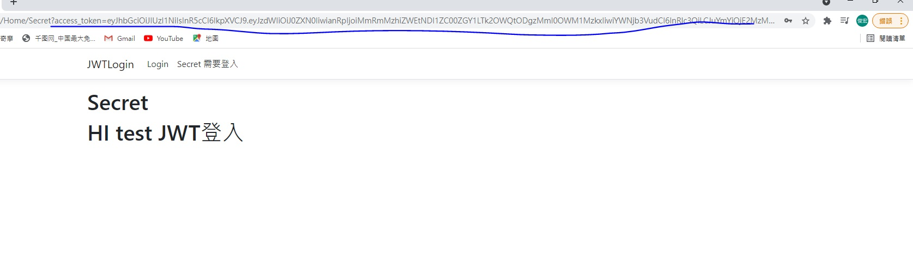
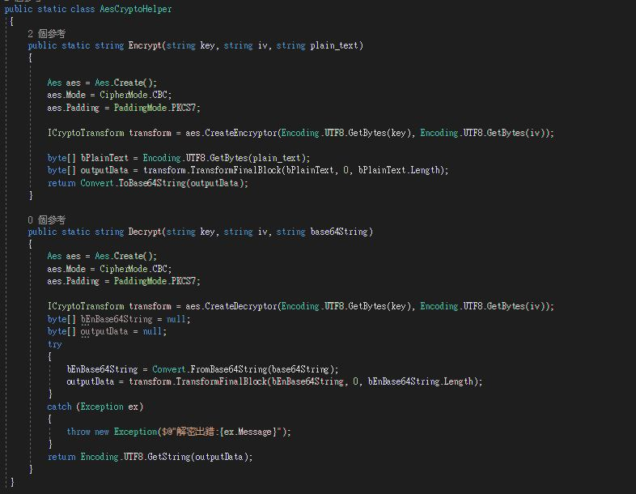
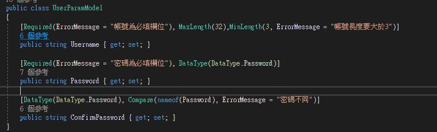
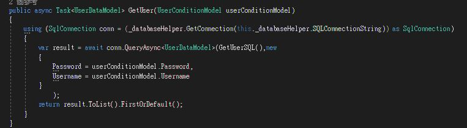
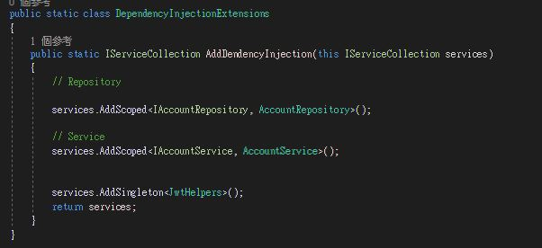

# JWTLogin 範例碼

## 使用方法

方法一

1.修改appsettings的db連結

DatabaseServer

DatabaseName

DatabaseUser

DatabasePassword

2.run code(初始資料會自動寫入)

登入

註冊畫面

登入Jwt

AES256

FilterAttribute

Dapper

Dependency Injection

架構

